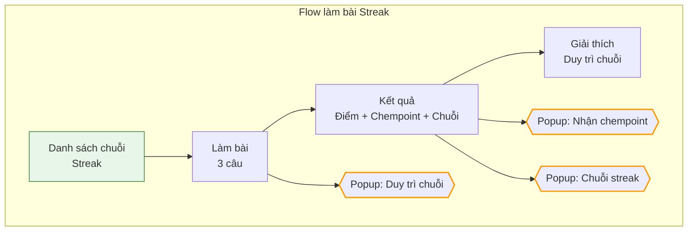
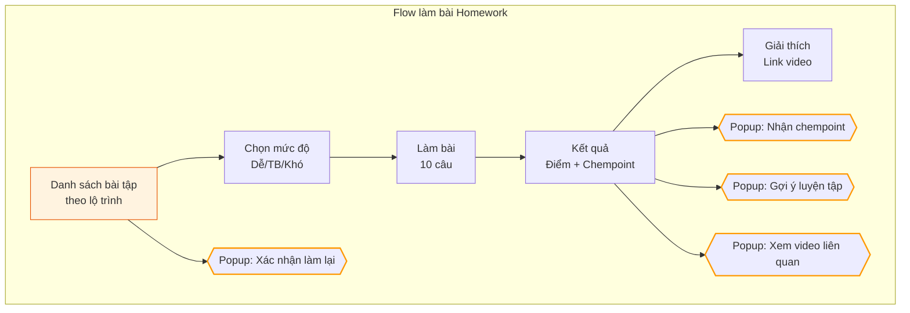
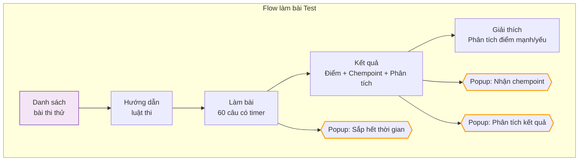
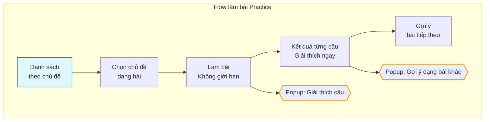
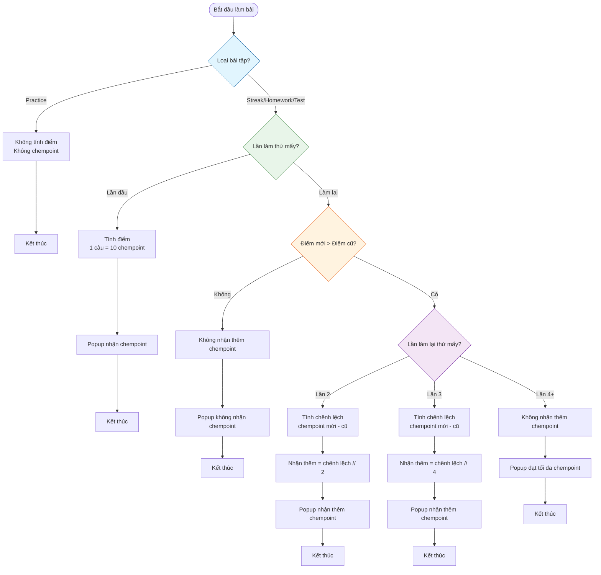

# Tổng Hợp Thiết Kế UI/UX Hệ Thống Bài Tập

## Giới Thiệu

Tài liệu này tổng hợp tất cả các màn hình, popup và nội dung theo từng chức năng làm bài trong hệ thống học tập, phân biệt rõ các loại bài tập khác nhau (Streak, Homework, Test, Practice) và luồng UI/UX tương ứng.

## Mục Lục

- [I. Bảng Tổng Hợp Screen Theo Từng Loại Bài Tập](#i-bảng-tổng-hợp-screen-theo-từng-loại-bài-tập)
- [II. Bảng Tổng Hợp Popup Theo Từng Loại Bài Tập](#ii-bảng-tổng-hợp-popup-theo-từng-loại-bài-tập)
- [III. Sơ Đồ Tổng Hợp Theo Từng Loại Bài Tập](#iii-sơ-đồ-tổng-hợp-theo-từng-loại-bài-tập)
  - [1. Sơ Đồ Cho Streak](#1-sơ-đồ-cho-streak)
  - [2. Sơ Đồ Cho Homework](#2-sơ-đồ-cho-homework)
  - [3. Sơ Đồ Cho Test](#3-sơ-đồ-cho-test)
  - [4. Sơ Đồ Cho Practice](#4-sơ-đồ-cho-practice)
- [IV. Chi Tiết Từng Màn Hình Và Popup](#iv-chi-tiết-từng-màn-hình-và-popup)
  - [1. STREAK (Làm 3 câu mỗi ngày)](#1-streak-làm-3-câu-mỗi-ngày)
  - [2. HOMEWORK (Bài tập theo lộ trình)](#2-homework-bài-tập-theo-lộ-trình)
  - [3. TEST (Bài thi thử)](#3-test-bài-thi-thử)
  - [4. PRACTICE (Luyện tập tự do)](#4-practice-luyện-tập-tự-do)
- [V. Sơ Đồ Luồng Tính Điểm Và Chempoint](#v-sơ-đồ-luồng-tính-điểm-và-chempoint)

## I. Bảng Tổng Hợp Screen Theo Từng Loại Bài Tập

| Screen | Streak | Homework | Test | Practice |
|--------|--------|----------|------|----------|
| **Danh sách** | Hiển thị chuỗi ngày liên tiếp, nhắc nhở làm hàng ngày | Danh sách theo lộ trình, chương, tag video, 3 mức độ | Danh sách bài thi thử | Danh sách theo chủ đề, gợi ý dạng bài |
| **Bắt đầu** | Vào làm luôn không qua màn xác nhận | Chọn mức độ (Dễ/TB/Khó) | Hướng dẫn luật thi, countdown | Chọn chủ đề, dạng bài |
| **Làm bài** | 3 câu, 2 câu dễ + 1 câu khó | 10 câu, theo mức độ đã chọn | 60 câu (trắc nghiệm, đúng/sai, trả lời ngắn), có timer | Không giới hạn số câu, theo chủ đề đã chọn |
| **Kết quả** | Hiển thị điểm, chempoint, chuỗi streak | Hiển thị điểm, chempoint, gắn với video | Hiển thị điểm, điểm theo từng phần, chempoint | Không hiển thị tổng điểm, chỉ kết quả từng câu |
| **Giải thích** | Giải thích ngắn gọn, nên làm tiếp câu khó | Giải thích chi tiết, link video liên quan | Giải thích chi tiết, phân tích điểm mạnh/yếu | Giải thích ngay sau mỗi câu |

## II. Bảng Tổng Hợp Popup Theo Từng Loại Bài Tập

| Popup | Streak | Homework | Test | Practice |
|-------|--------|----------|------|----------|
| **Xác nhận làm lại** | Không có | "Bạn đã làm bài này X lần. Làm lại để cải thiện điểm số..." | "Bạn đã làm bài thi này X lần. Làm lại để cải thiện điểm số..." | Không có |
| **Nhận chempoint lần đầu** | "Bạn nhận được X chempoint! Duy trì chuỗi streak để nhận thêm!" | "Bạn nhận được X chempoint cho bài tập này!" | "Bạn nhận được X chempoint cho bài thi này!" | Không có |
| **Nhận chempoint làm lại** | Không có | "Chúc mừng! Bạn nhận thêm Y chempoint nhờ cải thiện điểm số." | "Chúc mừng! Bạn nhận thêm Y chempoint nhờ cải thiện điểm số." | Không có |
| **Không nhận thêm chempoint** | Không có | "Bạn không nhận thêm chempoint vì điểm số không cao hơn lần trước." | "Bạn không nhận thêm chempoint vì điểm số không cao hơn lần trước." | Không có |
| **Đạt tối đa chempoint** | Không có | "Bạn đã nhận tối đa chempoint cho bài tập này." | "Bạn đã nhận tối đa chempoint cho bài thi này." | Không có |
| **Nhắc sắp hết thời gian** | Không có | Không có | "Chỉ còn 5 phút! Hãy kiểm tra lại câu trả lời." | Không có |
| **Gợi ý luyện tập thêm** | "Bạn nên luyện tập thêm dạng này ở khu luyện tập." | "Bạn nên xem lại video bài giảng và luyện tập thêm ở khu luyện tập." | "Bạn cần cải thiện phần X. Hãy luyện tập thêm ở khu luyện tập." | "Thử làm thêm dạng bài tương tự để cải thiện." |
| **Động viên hoàn thành** | "Chúc mừng! Bạn duy trì chuỗi streak X ngày!" | "Bạn đã hoàn thành bài tập! Hãy xem lại giải thích để củng cố kiến thức." | "Bạn đã hoàn thành bài thi! Hãy xem lại phân tích kết quả." | "Tiếp tục luyện tập các dạng bài khác!" |

## III. Sơ Đồ Tổng Hợp Theo Từng Loại Bài Tập

### 1. Sơ Đồ Cho Streak

### 2. Sơ Đồ Cho Homework

### 3. Sơ Đồ Cho Test

### 4. Sơ Đồ Cho Practice

## IV. Chi Tiết Từng Màn Hình Và Popup

### 1. STREAK (Làm 3 câu mỗi ngày)

#### 1.1. Screen Streak - Danh sách
- **Hiển thị:** Chuỗi ngày liên tiếp đã làm, nhắc nhở làm hàng ngày
- **Nút:** "Làm Streak hôm nay", "Xem lịch sử Streak"
- **Khác biệt:** Không có màn xác nhận, vào làm luôn

#### 1.2. Screen Streak - Làm bài
- **Hiển thị:** 3 câu (2 câu dễ, lý thuyết + 1 câu khó)
- **Nút:** "Nộp", "Tiếp tục làm câu khó"
- **Khác biệt:** Tối giản thao tác, giữ chuỗi

#### 1.3. Screen Streak - Kết quả
- **Hiển thị:** Điểm, chempoint, chuỗi streak hiện tại
- **Nút:** "Xem giải thích", "Làm tiếp câu khó"
- **Khác biệt:** Tập trung vào chuỗi streak, không phân tích chi tiết

#### 1.4. Popup Streak
- **Popup duy trì chuỗi:** "Làm 3 câu hôm nay để duy trì chuỗi Streak!"
- **Popup nhận chempoint:** "Bạn nhận được X chempoint! Duy trì chuỗi streak để nhận thêm!"
- **Popup chuỗi streak:** "Chúc mừng! Bạn duy trì chuỗi streak X ngày!"

### 2. HOMEWORK (Bài tập theo lộ trình)

#### 2.1. Screen Homework - Danh sách
- **Hiển thị:** Danh sách bài tập theo chương, tag video, trạng thái, điểm cao nhất
- **Nút:** "Làm bài", "Làm lại", "Xem video", "Xem giải thích"
- **Khác biệt:** Gắn với video, có 3 mức độ, có thể làm lại

#### 2.2. Screen Homework - Chọn mức độ
- **Hiển thị:** 3 mức độ (Dễ, Trung bình, Khó)
- **Nút:** "Bắt đầu", "Xem video trước khi làm"
- **Khác biệt:** Cho phép chọn độ khó

#### 2.3. Screen Homework - Làm bài
- **Hiển thị:** 10 câu, theo mức độ đã chọn
- **Nút:** "Nộp bài", "Đánh dấu câu chưa chắc", "Xem video"
- **Khác biệt:** Gắn với video, có thể tham khảo video khi làm

#### 2.4. Screen Homework - Kết quả
- **Hiển thị:** Điểm, chempoint, gắn với video
- **Nút:** "Xem giải thích", "Làm lại", "Xem video"
- **Khác biệt:** Có thể làm lại để cải thiện điểm và nhận thêm chempoint

#### 2.5. Popup Homework
- **Popup xác nhận làm lại:** "Bạn đã làm bài này X lần. Làm lại để cải thiện điểm số..."
- **Popup nhận chempoint lần đầu:** "Bạn nhận được X chempoint cho bài tập này!"
- **Popup nhận chempoint làm lại:** "Chúc mừng! Bạn nhận thêm Y chempoint nhờ cải thiện điểm số."
- **Popup không nhận thêm chempoint:** "Bạn không nhận thêm chempoint vì điểm số không cao hơn lần trước."
- **Popup đạt tối đa chempoint:** "Bạn đã nhận tối đa chempoint cho bài tập này."
- **Popup gợi ý luyện tập:** "Bạn nên xem lại video bài giảng và luyện tập thêm ở khu luyện tập."

### 3. TEST (Bài thi thử)

#### 3.1. Screen Test - Danh sách
- **Hiển thị:** Danh sách bài thi thử, trạng thái, điểm cao nhất
- **Nút:** "Bắt đầu thi", "Làm lại", "Xem kết quả"
- **Khác biệt:** Bài thi thử, có giới hạn thời gian, cấu trúc giống thi thật

#### 3.2. Screen Test - Hướng dẫn luật thi
- **Hiển thị:** Luật thi, cấu trúc đề, thời gian
- **Nút:** "Bắt đầu thi"
- **Khác biệt:** Có hướng dẫn chi tiết trước khi thi

#### 3.3. Screen Test - Làm bài
- **Hiển thị:** 60 câu (trắc nghiệm 4 lựa chọn, đúng/sai, trả lời ngắn), timer đếm ngược
- **Nút:** "Nộp bài", "Câu trước", "Câu sau", "Đánh dấu câu chưa chắc"
- **Khác biệt:** Có đồng hồ đếm ngược, giống bài thi thật

#### 3.4. Screen Test - Kết quả
- **Hiển thị:** Điểm, điểm theo từng phần, chempoint, thời gian làm
- **Nút:** "Xem phân tích", "Làm lại", "Xem giải thích"
- **Khác biệt:** Phân tích chi tiết điểm theo từng phần

#### 3.5. Popup Test
- **Popup sắp hết thời gian:** "Chỉ còn 5 phút! Hãy kiểm tra lại câu trả lời."
- **Popup nhận chempoint:** "Bạn nhận được X chempoint cho bài thi này!"
- **Popup nhận chempoint làm lại:** "Chúc mừng! Bạn nhận thêm Y chempoint nhờ cải thiện điểm số."
- **Popup không nhận thêm chempoint:** "Bạn không nhận thêm chempoint vì điểm số không cao hơn lần trước."
- **Popup phân tích kết quả:** "Bạn cần cải thiện phần X. Hãy luyện tập thêm ở khu luyện tập."

### 4. PRACTICE (Luyện tập tự do)

#### 4.1. Screen Practice - Danh sách
- **Hiển thị:** Danh sách theo chủ đề, gợi ý dạng bài dựa trên kết quả
- **Nút:** "Chọn chủ đề", "Tìm kiếm dạng bài", "Làm theo gợi ý AI"
- **Khác biệt:** Tự do chọn chủ đề, có gợi ý từ AI

#### 4.2. Screen Practice - Chọn chủ đề
- **Hiển thị:** Danh sách chủ đề, dạng bài
- **Nút:** "Bắt đầu luyện tập"
- **Khác biệt:** Không giới hạn, tự do chọn

#### 4.3. Screen Practice - Làm bài
- **Hiển thị:** Câu hỏi theo chủ đề đã chọn, không giới hạn số câu
- **Nút:** "Kiểm tra", "Câu tiếp theo", "Đổi dạng bài"
- **Khác biệt:** Hiển thị kết quả và giải thích ngay sau mỗi câu

#### 4.4. Screen Practice - Kết quả từng câu
- **Hiển thị:** Kết quả, giải thích chi tiết ngay sau mỗi câu
- **Nút:** "Câu tiếp theo", "Làm lại câu này", "Dạng bài tương tự"
- **Khác biệt:** Không tổng kết điểm, không chempoint

#### 4.5. Popup Practice
- **Popup giải thích câu:** Hiển thị ngay sau khi trả lời từng câu
- **Popup gợi ý dạng bài khác:** "Thử làm thêm dạng bài tương tự để cải thiện."
- **Popup động viên:** "Tiếp tục luyện tập các dạng bài khác!"

## V. Sơ Đồ Luồng Tính Điểm Và Chempoint

---

*Tài liệu này được tạo để giúp team phát triển hiểu rõ các màn hình, popup và logic tính điểm trong hệ thống học tập. Mỗi loại bài tập có đặc điểm riêng, cần được thiết kế phù hợp để tối ưu trải nghiệm học tập cho học sinh.*
