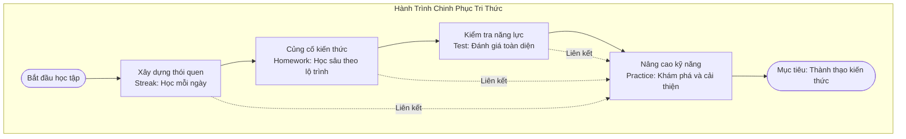
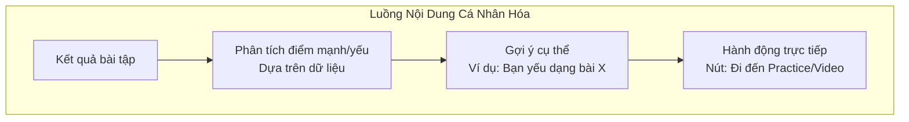
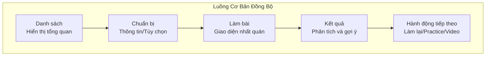
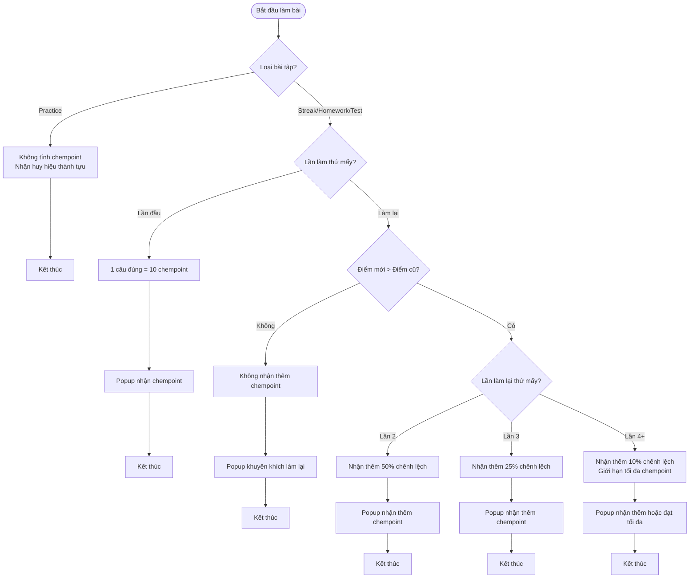
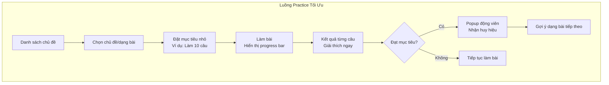
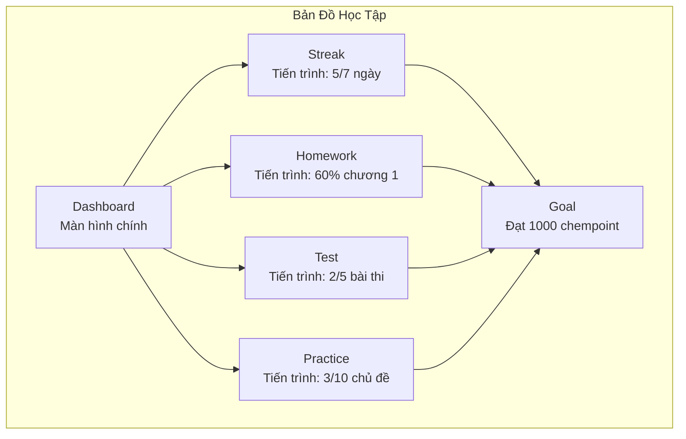

# Tổng Hợp Phân Tích và Cải Thiện Thiết Kế UI/UX Hệ Thống Bài Tập

Dựa trên tài liệu thiết kế UI/UX của hệ thống bài tập, bài viết này tập trung vào việc phân tích và cải thiện **concept (khái niệm)**, **content (nội dung)**, và **flow (luồng trải nghiệm)** để tối ưu hóa quy luật chặt chẽ, nâng cao trải nghiệm học sinh, và giúp họ dễ dàng hình dung bức tranh tổng quát của hệ thống. Nội dung bao gồm các vấn đề hiện tại, giải pháp đề xuất, bảng tóm tắt, và sơ đồ minh họa.

---

## 1. Concept (Khái Niệm) - Xây Dựng Ý Tưởng Cốt Lõi Rõ Ràng và Nhất Quán

### 1.1. Bảng Tóm Tắt Vấn Đề và Giải Pháp Về Concept
| **Vấn Đề Hiện Tại**                                      | **Hậu Quả**                                              | **Giải Pháp Đề Xuất**                                                                                     |
|----------------------------------------------------------|---------------------------------------------------------|-----------------------------------------------------------------------------------------------------------|
| Khái niệm chưa đồng bộ giữa các loại bài tập (Streak, Homework, Test, Practice) | Học sinh cảm thấy hệ thống phân mảnh, không hiểu mối liên hệ giữa các loại bài tập | Xây dựng khái niệm cốt lõi "Hành trình chinh phục tri thức" với 4 giai đoạn tương ứng 4 loại bài tập |
| Thiếu định hướng động lực, đặc biệt với Practice (không có chempoint) | Học sinh có thể bỏ qua Practice dù nó quan trọng cho việc củng cố kiến thức | Tích hợp phần thưởng xuyên suốt (chempoint cho Streak/Homework/Test, huy hiệu thành tựu cho Practice) |
| Không rõ giá trị tổng thể của hệ thống                  | Học sinh không hiểu tại sao cần làm cả 4 loại bài tập   | Tạo "Bản đồ học tập" (Learning Map) để hiển thị tiến trình và mối liên hệ giữa các loại bài tập       |

### 1.2. Sơ Đồ Khái Niệm Cốt Lõi "Hành Trình Chinh Phục Tri Thức"

**Giải thích sơ đồ:** Sơ đồ này minh họa khái niệm cốt lõi "Hành trình chinh phục tri thức", trong đó 4 loại bài tập đại diện cho 4 giai đoạn học tập. Mỗi giai đoạn có vai trò riêng nhưng liên kết với nhau, đặc biệt Practice là nơi cải thiện điểm yếu từ các loại bài tập khác.

---

## 2. Content (Nội Dung) - Tối Ưu Hóa Thông Điệp và Hướng Dẫn

### 2.1. Bảng Tóm Tắt Vấn Đề và Giải Pháp Về Content
| **Vấn Đề Hiện Tại**                                      | **Hậu Quả**                                              | **Giải Pháp Đề Xuất**                                                                                     |
|----------------------------------------------------------|---------------------------------------------------------|-----------------------------------------------------------------------------------------------------------|
| Nội dung popup và thông báo chung chung, không cá nhân hóa | Học sinh có thể bỏ qua thông điệp, không thấy hữu ích   | Cá nhân hóa nội dung dựa trên kết quả (ví dụ: gợi ý cụ thể dạng bài yếu và liên kết đến bài tập liên quan) |
| Thiếu hướng dẫn ban đầu cho học sinh mới                | Học sinh bối rối khi tiếp cận các loại bài tập khác nhau | Thêm tutorial ngắn hoặc video onboarding giới thiệu 4 loại bài tập và cách chúng liên kết             |
| Thông tin kết quả chưa đủ sâu sắc (ví dụ: Streak chỉ có điểm và chuỗi) | Học sinh không hiểu điểm mạnh/yếu của mình             | Bổ sung phân tích ngắn gọn trong kết quả (ví dụ: tỷ lệ đúng/sai theo dạng bài, biểu đồ nhỏ)           |
| Ngôn ngữ chưa đủ thân thiện và động viên                | Học sinh có thể cảm thấy áp lực hoặc thiếu động lực     | Sử dụng giọng điệu tích cực, gần gũi trong mọi thông điệp (ví dụ: thay thông báo tiêu cực bằng khuyến khích) |

### 2.2. Sơ Đồ Luồng Nội Dung Cá Nhân Hóa

**Giải thích sơ đồ:** Sơ đồ này cho thấy cách nội dung có thể được cá nhân hóa từ kết quả bài tập. Thay vì thông báo chung chung, hệ thống phân tích dữ liệu, đưa ra gợi ý cụ thể, và cung cấp hành động trực tiếp để học sinh dễ dàng thực hiện.

---

## 3. Flow (Luồng Trải Nghiệm) - Tối Ưu Hóa Quy Luật Chặt Chẽ và Trải Nghiệm Mượt Mà

### 3.1. Bảng Tóm Tắt Vấn Đề và Giải Pháp Về Flow
| **Vấn Đề Hiện Tại**                                      | **Hậu Quả**                                              | **Giải Pháp Đề Xuất**                                                                                     |
|----------------------------------------------------------|---------------------------------------------------------|-----------------------------------------------------------------------------------------------------------|
| Luồng không nhất quán giữa các loại bài tập             | Học sinh khó khăn khi chuyển đổi giữa các loại bài tập  | Đồng bộ hóa luồng cơ bản với 4 bước (Danh sách → Chuẩn bị → Làm bài → Kết quả) cho tất cả loại bài tập |
| Thiếu xử lý trường hợp đặc biệt (thoát giữa chừng, hết thời gian Test, thời gian Streak) | Trải nghiệm không liền mạch, học sinh có thể mất dữ liệu hoặc lạm dụng hệ thống | Thêm cơ chế lưu tạm thời (Homework/Test), tự động nộp bài khi hết thời gian (Test), định nghĩa khung giờ Streak |
| Logic chempoint chưa chặt chẽ (lần làm lại thứ 4+ không nhận thêm) | Học sinh không được khuyến khích cải thiện điểm số      | Tối ưu hóa logic: Lần 2 (50% chênh lệch), Lần 3 (25%), Lần 4+ (10%), đặt giới hạn tối đa chempoint     |
| Luồng Practice thiếu mục tiêu, không có tổng điểm       | Học sinh không biết khi nào dừng hoặc chuyển dạng bài   | Thêm progress bar, mục tiêu nhỏ (mini-goals), và huy hiệu thành tựu để định hướng cho Practice         |
| Thiếu liên kết giữa các loại bài tập trong luồng        | Học sinh không thấy mối quan hệ giữa các loại bài tập   | Tích hợp gợi ý chuyển đổi (ví dụ: Sau Streak gợi ý Homework, sau Test gợi ý Practice cho dạng bài yếu) |

### 3.2. Sơ Đồ Luồng Cơ Bản Đồng Bộ Cho Tất Cả Loại Bài Tập

**Giải thích sơ đồ:** Sơ đồ này minh họa luồng cơ bản được đồng bộ cho tất cả loại bài tập, gồm 4 bước chính. Dù mỗi loại có đặc thù riêng (ví dụ: Streak không có bước Chuẩn bị), cấu trúc chung giúp học sinh dễ làm quen và chuyển đổi giữa các loại.

### 3.3. Sơ Đồ Logic Chempoint Tối Ưu Hóa

**Giải thích sơ đồ:** Sơ đồ này thể hiện logic chempoint được tối ưu hóa, khuyến khích học sinh làm lại bằng cách giảm dần tỷ lệ chempoint nhận thêm nhưng vẫn có phần thưởng ở các lần sau (10% từ lần 4 trở đi), đồng thời đặt giới hạn tối đa để tránh lạm dụng.

### 3.4. Sơ Đồ Luồng Practice Với Mục Tiêu Rõ Ràng

**Giải thích sơ đồ:** Luồng Practice được cải thiện với mục tiêu nhỏ và progress bar, giúp học sinh có định hướng rõ ràng. Khi đạt mục tiêu, hệ thống động viên và gợi ý tiếp tục, tạo trải nghiệm liền mạch và có động lực.

---

## 4. Bức Tranh Tổng Quát - Giúp Học Sinh Hình Dung Hệ Thống Dễ Dàng

### 4.1. Sơ Đồ Bản Đồ Học Tập (Learning Map)

**Giải thích sơ đồ:** Sơ đồ này minh họa giao diện "Bản đồ học tập" như một dashboard tổng quan, hiển thị tiến trình của học sinh trên 4 loại bài tập. Mỗi khu vực có thể nhấp vào để đi thẳng đến loại bài tập tương ứng, và tất cả hướng đến mục tiêu lớn (ví dụ: đạt 1000 chempoint).

---

## 5. Kết Luận
Các bảng và sơ đồ trên giúp làm rõ các vấn đề hiện tại trong **concept**, **content**, và **flow** của hệ thống, đồng thời cung cấp giải pháp cụ thể để tối ưu hóa trải nghiệm học sinh. 
- **Concept** được cải thiện bằng khái niệm cốt lõi "Hành trình chinh phục tri thức" và "Bản đồ học tập".
- **Content** được cá nhân hóa và thân thiện hơn với hướng dẫn ban đầu và phân tích kết quả chi tiết.
- **Flow** được đồng bộ hóa, xử lý trường hợp đặc biệt, và tối ưu hóa logic chempoint cũng như luồng Practice.

Nếu bạn muốn đi sâu hơn vào một sơ đồ cụ thể hoặc cần thêm thông tin, hãy liên hệ để được hỗ trợ thêm!
