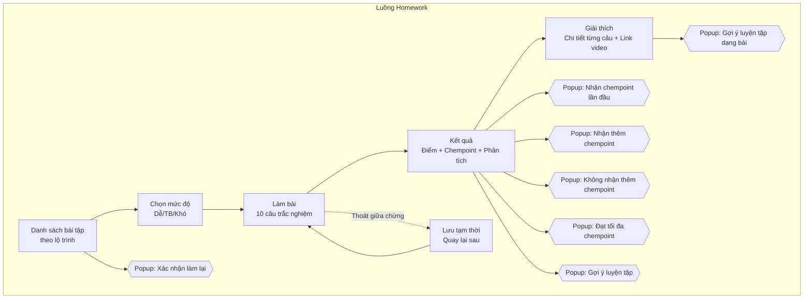
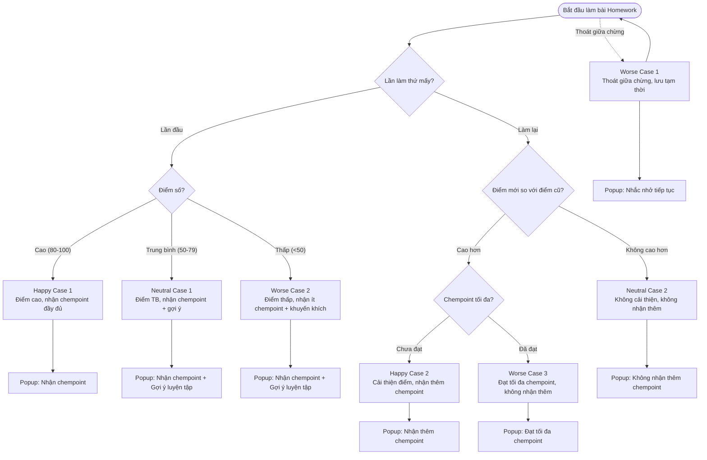
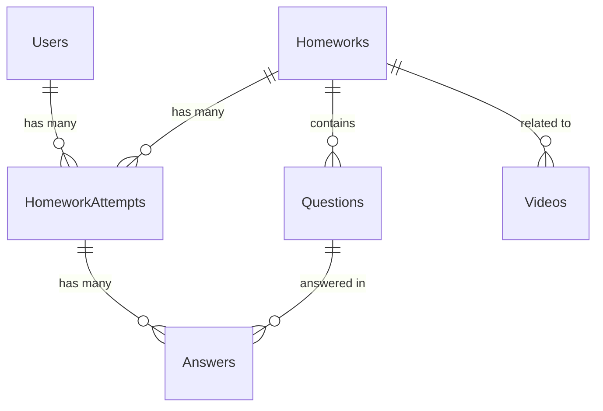
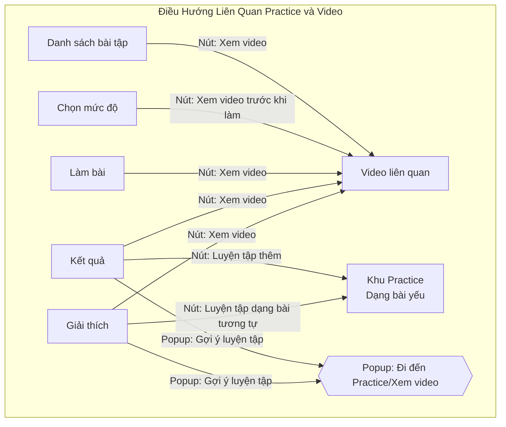

# Phân Tích Chi Tiết Tính Năng Homework Trong Hệ Thống Bài Tập

Tài liệu này tập trung vào việc phân tích chi tiết tính năng **Homework (Bài tập theo lộ trình)** trong hệ thống học tập, với mục tiêu tối ưu hóa trải nghiệm của học sinh. Nội dung bao gồm luồng tham gia của người dùng, các màn hình và popup cần thiết, các user case từ happy đến worse case, MVP (Minimum Viable Product), schema database, và cách điều hướng liên quan đến khu luyện tập (Practice) và xem lại video. Tất cả bài tập Homework đều ở dạng trắc nghiệm.

---

## 1. Tổng Hợp Luồng User Tham Gia, Screen, Popup và Content

### 1.1. Bảng Tóm Tắt Luồng User Tham Gia, Screen, Popup và Content
| **Bước**                | **Screen**                          | **Nội Dung Hiển Thị (Content)**                                                                 | **Tương Tác Của Học Sinh**                              | **Popup (Nếu Có)**                                                                 | **Nội Dung Popup**                                                                                     |
|-------------------------|-------------------------------------|------------------------------------------------------------------------------------------------|---------------------------------------------------------|-----------------------------------------------------------------------------------|-------------------------------------------------------------------------------------------------------|
| **1. Danh sách bài tập** | Danh sách Homework theo lộ trình   | Danh sách bài tập theo chương, tag video, trạng thái (chưa làm/đã làm), điểm cao nhất, mức độ | Chọn bài tập, nhấn "Làm bài" hoặc "Làm lại", "Xem video" | Popup xác nhận làm lại (nếu đã làm trước đó)                                      | "Bạn đã làm bài này X lần. Làm lại để cải thiện điểm số?" (Nút: "Làm lại", "Hủy")                    |
| **2. Chọn mức độ**      | Chọn mức độ (Dễ/TB/Khó)            | 3 mức độ với mô tả ngắn (Dễ: Cơ bản, TB: Nâng cao, Khó: Thách thức)                            | Chọn mức độ, nhấn "Bắt đầu", "Xem video trước khi làm"  | Không có                                                                         | Không có                                                                                              |
| **3. Làm bài**          | Màn hình làm bài trắc nghiệm       | 10 câu trắc nghiệm (4 lựa chọn), tiến trình (câu X/10), nút điều hướng câu                    | Chọn đáp án, "Nộp bài", "Đánh dấu câu chưa chắc", "Xem video" | Không có                                                                         | Không có                                                                                              |
| **4. Kết quả**          | Màn hình kết quả                   | Điểm số, chempoint nhận được, tỷ lệ đúng/sai, phân tích ngắn gọn theo dạng bài                | Nhấn "Xem giải thích", "Làm lại", "Xem video", "Luyện tập thêm" | - Popup nhận chempoint (lần đầu) - Popup nhận thêm chempoint (làm lại) - Popup không nhận thêm chempoint - Popup đạt tối đa chempoint - Popup gợi ý luyện tập | - "Bạn nhận được X chempoint cho bài tập này!" - "Chúc mừng! Bạn nhận thêm Y chempoint nhờ cải thiện điểm số." - "Bạn không nhận thêm chempoint vì điểm số không cao hơn lần trước." - "Bạn đã nhận tối đa chempoint cho bài tập này." - "Bạn nên xem lại video bài giảng và luyện tập thêm ở khu luyện tập." (Nút: "Đi đến Practice", "Xem video") |
| **5. Giải thích**       | Màn hình giải thích chi tiết       | Giải thích từng câu (đáp án đúng, lý do), link video liên quan                                | Nhấn "Quay lại kết quả", "Làm lại", "Xem video", "Luyện tập dạng bài tương tự"  | Popup gợi ý luyện tập                                                     | "Thử làm thêm dạng bài tương tự tại khu Practice để cải thiện!" (Nút: "Đi đến Practice")             |

### 1.2. Sơ Đồ Luồng User Tham Gia Homework

**Giải thích sơ đồ:** Luồng Homework bao gồm 5 bước chính từ danh sách bài tập đến giải thích chi tiết. Các popup xuất hiện ở các giai đoạn phù hợp để thông báo chempoint hoặc gợi ý hành động. Cơ chế lưu tạm thời được thêm để xử lý trường hợp thoát giữa chừng.

---

## 2. Liệt Kê Toàn Bộ User Case Từ Happy đến Worse Case

### 2.1. Bảng Tóm Tắt User Case và Cách Xử Lý Content, Popup
| **User Case**                          | **Mô Tả**                                                                 | **Kết Quả**                              | **Content Hiển Thị**                                                                 | **Popup**                                                                                     | **Nội Dung Popup và Hành Động**                                                                 |
|----------------------------------------|---------------------------------------------------------------------------|------------------------------------------|---------------------------------------------------------------------------------------------|---------------------------------------------------------------------------------------------|-------------------------------------------------------------------------------------------------|
| **Happy Case 1: Hoàn thành lần đầu, điểm cao** | Học sinh làm bài lần đầu, đạt điểm cao (ví dụ: 90/100)                   | Nhận chempoint đầy đủ                   | Kết quả: "Điểm: 90/100, Chempoint: +90. Bạn làm rất tốt!" + Phân tích dạng bài             | Popup nhận chempoint                                                                        | "Bạn nhận được 90 chempoint cho bài tập này!" (Nút: "Xem giải thích")                          |
| **Happy Case 2: Làm lại, cải thiện điểm** | Học sinh làm lại, điểm mới cao hơn điểm cũ (ví dụ: từ 70 lên 85)         | Nhận thêm chempoint theo chênh lệch     | Kết quả: "Điểm mới: 85/100, Điểm cũ: 70/100, Chempoint thêm: +7" + Phân tích cải thiện    | Popup nhận thêm chempoint                                                                   | "Chúc mừng! Bạn nhận thêm 7 chempoint nhờ cải thiện điểm số." (Nút: "Xem giải thích")          |
| **Neutral Case 1: Hoàn thành, điểm trung bình** | Học sinh làm bài, đạt điểm trung bình (ví dụ: 60/100)                   | Nhận chempoint tương ứng               | Kết quả: "Điểm: 60/100, Chempoint: +60. Bạn có thể cải thiện thêm!" + Phân tích điểm yếu   | Popup nhận chempoint + Popup gợi ý luyện tập                                                | "Bạn nhận được 60 chempoint!" + "Bạn nên xem lại video và luyện tập thêm ở khu Practice." (Nút: "Đi đến Practice", "Xem video") |
| **Neutral Case 2: Làm lại, điểm không cải thiện** | Học sinh làm lại, điểm mới không cao hơn điểm cũ (ví dụ: 70 xuống 65)   | Không nhận thêm chempoint              | Kết quả: "Điểm mới: 65/100, Điểm cũ: 70/100. Đừng lo, hãy thử lại!" + Phân tích điểm yếu   | Popup không nhận thêm chempoint                                                             | "Bạn không nhận thêm chempoint vì điểm số không cao hơn lần trước. Thử lại nhé!" (Nút: "Làm lại") |
| **Worse Case 1: Thoát giữa chừng**    | Học sinh thoát khi đang làm bài (do mất mạng hoặc cố ý)                  | Bài làm được lưu tạm thời              | Thông báo khi đăng nhập lại: "Bài làm của bạn đã được lưu. Tiếp tục hoàn thành nhé!"        | Popup nhắc nhở tiếp tục                                                                    | "Bài làm của bạn chưa hoàn thành. Tiếp tục ngay?" (Nút: "Tiếp tục", "Hủy")                     |
| **Worse Case 2: Điểm rất thấp**        | Học sinh hoàn thành nhưng điểm rất thấp (ví dụ: 20/100)                 | Nhận ít chempoint, khuyến khích cải thiện | Kết quả: "Điểm: 20/100, Chempoint: +20. Đừng lo, hãy xem giải thích và thử lại!" + Phân tích | Popup nhận chempoint + Popup gợi ý luyện tập                                                | "Bạn nhận được 20 chempoint!" + "Bạn cần cải thiện nhiều. Xem video và luyện tập thêm nhé!" (Nút: "Đi đến Practice", "Xem video") |
| **Worse Case 3: Đạt tối đa chempoint** | Học sinh làm lại nhiều lần, đã đạt giới hạn chempoint tối đa (ví dụ: 150) | Không nhận thêm chempoint dù điểm cao hơn | Kết quả: "Điểm mới: 95/100, Điểm cũ: 90/100. Bạn đã đạt tối đa chempoint!"                | Popup đạt tối đa chempoint                                                                  | "Bạn đã nhận tối đa chempoint cho bài tập này. Thử bài khác để nhận thêm!" (Nút: "Danh sách bài tập") |

### 2.2. Sơ Đồ User Case Từ Happy đến Worse Case

**Giải thích sơ đồ:** Sơ đồ này minh họa các user case từ happy (điểm cao, cải thiện điểm) đến worse case (thoát giữa chừng, điểm thấp, đạt tối đa chempoint). Mỗi trường hợp đều có popup tương ứng để thông báo hoặc khuyến khích học sinh.

---

## 3. MVP (Minimum Viable Product) Cần Thực Hiện và Checklist

### 3.1. MVP Cho Tính Năng Homework
MVP tập trung vào các tính năng cốt lõi để đảm bảo học sinh có thể sử dụng Homework một cách cơ bản và hiệu quả:
- **Danh sách bài tập:** Hiển thị danh sách bài tập theo lộ trình, trạng thái, và điểm cao nhất.
- **Chọn mức độ:** Cho phép chọn 3 mức độ (Dễ, Trung bình, Khó).
- **Làm bài trắc nghiệm:** Giao diện làm bài với 10 câu trắc nghiệm, nút nộp bài.
- **Kết quả và chempoint:** Hiển thị điểm, chempoint nhận được, phân tích cơ bản.
- **Giải thích:** Giải thích chi tiết từng câu, link video liên quan.
- **Popup cơ bản:** Popup nhận chempoint lần đầu, xác nhận làm lại, và gợi ý luyện tập.

### 3.2. Checklist Cho MVP
| **Tính Năng**                  | **Trạng Thái** | **Ghi Chú**                              |
|--------------------------------|----------------|------------------------------------------|
| Danh sách bài tập theo lộ trình | ☐ Chưa làm     | Cần hiển thị chương, trạng thái, điểm    |
| Chọn mức độ (Dễ/TB/Khó)        | ☐ Chưa làm     | Giao diện đơn giản, mô tả ngắn gọn       |
| Giao diện làm bài trắc nghiệm  | ☐ Chưa làm     | 10 câu, 4 lựa chọn, nút nộp bài         |
| Hiển thị kết quả và chempoint  | ☐ Chưa làm     | Điểm, chempoint, phân tích cơ bản        |
| Giải thích chi tiết từng câu   | ☐ Chưa làm     | Đáp án đúng, lý do, link video           |
| Popup nhận chempoint lần đầu   | ☐ Chưa làm     | Thông báo chempoint nhận được            |
| Popup xác nhận làm lại         | ☐ Chưa làm     | Hỏi xác nhận khi làm lại bài cũ          |
| Popup gợi ý luyện tập          | ☐ Chưa làm     | Gợi ý đi đến Practice hoặc xem video     |

---

## 4. Schema Database Cho Tính Năng Homework

### 4.1. Cấu Trúc Database Đề Xuất
Dưới đây là schema cơ bản cho tính năng Homework, tập trung vào các bảng chính và mối quan hệ giữa chúng:
- **Users**: Lưu thông tin học sinh (ID, tên, email, tổng chempoint, v.v.).
- **Homeworks**: Lưu danh sách bài tập Homework (ID, tên, chương, tag video, mức độ, v.v.).
- **HomeworkAttempts**: Lưu lịch sử làm bài của học sinh (ID, user_id, homework_id, điểm số, chempoint nhận được, thời gian hoàn thành, v.v.).
- **Questions**: Lưu câu hỏi trắc nghiệm (ID, homework_id, nội dung câu hỏi, đáp án đúng, giải thích, v.v.).
- **Answers**: Lưu đáp án của học sinh (ID, attempt_id, question_id, đáp án chọn, đúng/sai, v.v.).
- **Videos**: Lưu thông tin video liên quan (ID, tiêu đề, URL, tag liên quan đến bài tập, v.v.).

### 4.2. Schema Chi Tiết (Dạng Bảng)
| **Bảng**             | **Trường (Field)**                       | **Kiểu Dữ Liệu** | **Mô Tả**                              |
|----------------------|------------------------------------------|------------------|----------------------------------------|
| **Users**            | user_id                                  | INT (PK)         | ID duy nhất của học sinh              |
|                      | name                                     | VARCHAR          | Tên học sinh                          |
|                      | email                                    | VARCHAR          | Email học sinh                        |
|                      | total_chempoint                          | INT              | Tổng chempoint tích lũy               |
| **Homeworks**        | homework_id                              | INT (PK)         | ID duy nhất của bài tập               |
|                      | title                                    | VARCHAR          | Tên bài tập                           |
|                      | chapter                                  | VARCHAR          | Chương liên quan                      |
|                      | video_tag                                | VARCHAR          | Tag liên kết video                    |
|                      | difficulty_levels                        | ENUM('Dễ', 'TB', 'Khó') | Các mức độ khả dụng            |
| **HomeworkAttempts** | attempt_id                               | INT (PK)         | ID duy nhất của lần làm bài           |
|                      | user_id                                  | INT (FK)         | Liên kết đến Users                    |
|                      | homework_id                              | INT (FK)         | Liên kết đến Homeworks                |
|                      | score                                    | INT              | Điểm số (0-100)                       |
|                      | chempoint_earned                         | INT              | Chempoint nhận được                   |
|                      | completed_at                             | DATETIME         | Thời gian hoàn thành                  |
|                      | difficulty_level                         | ENUM('Dễ', 'TB', 'Khó') | Mức độ đã chọn                 |
| **Questions**        | question_id                              | INT (PK)         | ID duy nhất của câu hỏi               |
|                      | homework_id                              | INT (FK)         | Liên kết đến Homeworks                |
|                      | content                                  | TEXT             | Nội dung câu hỏi                      |
|                      | correct_answer                           | VARCHAR          | Đáp án đúng                           |
|                      | explanation                              | TEXT             | Giải thích chi tiết                   |
|                      | difficulty                               | ENUM('Dễ', 'TB', 'Khó') | Mức độ câu hỏi                 |
| **Answers**          | answer_id                                | INT (PK)         | ID duy nhất của đáp án                |
|                      | attempt_id                               | INT (FK)         | Liên kết đến HomeworkAttempts         |
|                      | question_id                              | INT (FK)         | Liên kết đến Questions                |
|                      | selected_answer                          | VARCHAR          | Đáp án học sinh chọn                  |
|                      | is_correct                               | BOOLEAN          | Đúng/Sai                              |
| **Videos**           | video_id                                 | INT (PK)         | ID duy nhất của video                 |
|                      | title                                    | VARCHAR          | Tiêu đề video                         |
|                      | url                                      | VARCHAR          | Link video                            |
|                      | tag                                      | VARCHAR          | Tag liên quan đến bài tập             |

### 4.3. Sơ Đồ Mối Quan Hệ Database

**Giải thích sơ đồ:** Sơ đồ ER (Entity-Relationship) này thể hiện mối quan hệ giữa các bảng. Một học sinh (Users) có thể có nhiều lần làm bài (HomeworkAttempts), một bài tập (Homeworks) có nhiều câu hỏi (Questions) và liên kết với video (Videos), mỗi lần làm bài có nhiều đáp án (Answers) tương ứng với các câu hỏi.

---

## 5. Điều Hướng Liên Quan Đến Khu Luyện Tập (Practice) và Xem Lại Video

### 5.1. Chiến Lược Điều Hướng
Để khuyến khích học sinh sử dụng khu luyện tập (Practice) và xem lại video, hệ thống cần tích hợp các điểm điều hướng thông minh tại các giai đoạn phù hợp trong luồng Homework:
- **Từ màn hình Danh sách bài tập:** Thêm nút "Xem video" bên cạnh mỗi bài tập để học sinh có thể xem trước nội dung liên quan.
- **Từ màn hình Chọn mức độ:** Thêm nút "Xem video trước khi làm" để học sinh ôn lại kiến thức trước khi bắt đầu.
- **Từ màn hình Làm bài:** Thêm nút "Xem video" để học sinh tham khảo nếu gặp khó khăn (có thể giới hạn số lần xem để tránh lạm dụng).
- **Từ màn hình Kết quả:** Thêm nút "Luyện tập thêm" dẫn trực tiếp đến khu Practice với dạng bài yếu (dựa trên phân tích kết quả), và nút "Xem video" dẫn đến video liên quan.
- **Từ màn hình Giải thích:** Thêm nút "Luyện tập dạng bài tương tự" dẫn đến Practice với các câu hỏi cùng dạng, và nút "Xem video" cho nội dung liên quan đến câu hỏi.
- **Popup gợi ý:** Các popup như "Gợi ý luyện tập" cần có nút hành động trực tiếp ("Đi đến Practice", "Xem video") để học sinh không phải tìm kiếm thủ công.

### 5.2. Sơ Đồ Điều Hướng Liên Quan Đến Practice và Video

**Giải thích sơ đồ:** Sơ đồ này minh họa các điểm điều hướng từ các màn hình Homework đến khu Practice và Video. Mỗi màn hình có nút hành động cụ thể, và các popup gợi ý cũng hỗ trợ điều hướng trực tiếp để tăng tính tiện lợi cho học sinh.

---

## 6. Kết Luận
Tài liệu này cung cấp phân tích chi tiết về tính năng **Homework**, bao gồm luồng tham gia của học sinh, các màn hình và popup cần thiết, các user case từ happy đến worse case, MVP và checklist, schema database, và chiến lược điều hướng đến khu luyện tập và video. Các bảng và sơ đồ giúp làm rõ các khía cạnh để đảm bảo trải nghiệm học sinh liền mạch, khuyến khích học tập sâu và cải thiện điểm số.

Nếu bạn cần đi sâu hơn vào một phần cụ thể (ví dụ: chi tiết giao diện màn hình hoặc mở rộng user case), hãy liên hệ để được hỗ trợ thêm!
